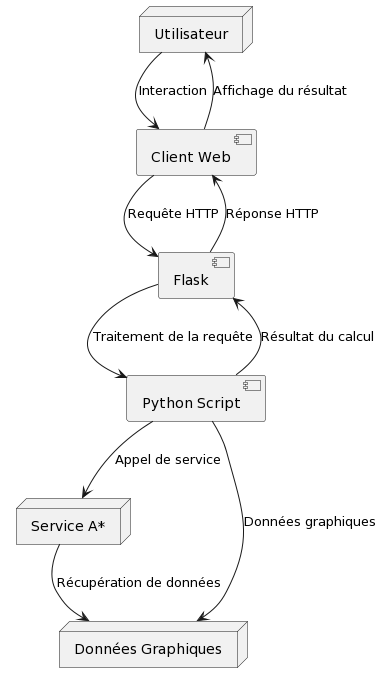

# Algo service layer

Ici c'est le layer algo diviser en container. Il y a une plus value 1 au niveau consomation on appel les services d'algo que quand on en a besoin et en plus l'API avec Flask c'est plustôt léger aussi. Example de post qui fonctionne : 

``curl -X POST http://localhost:3939/shortest_path -H "Content-Type: application/json" -d '{"graph": [[1,1,1,1],[1,0,1,1],[1,1,1,1],[1,1,1,1]], "start": [0,0], "goal": [3,3]}'``

